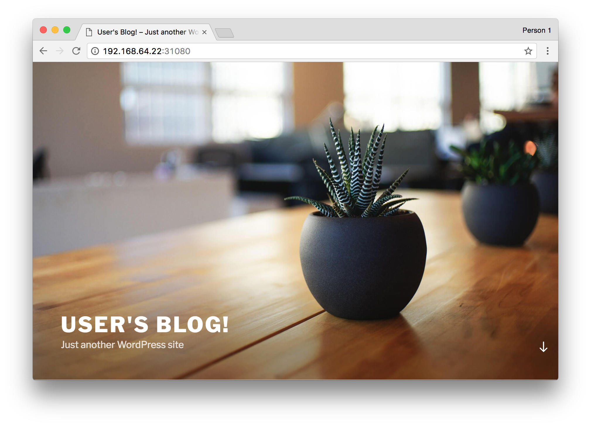

# MariaDB Broker

This is an implementation of a Service Broker that uses Helm to provision
instances of [MariaDB](https://kubeapps.com/charts/stable/mariadb). This is a
**proof-of-concept** for the [Kubernetes Service
Broker](https://github.com/kubernetes-incubator/service-catalog), and should not
be used in production.

[Learn more about the Kubernetes Service Catalog](https://medium.com/@prydonius/service-catalog-in-kubernetes-78c0736e3910)

## Prerequisites

1. Kubernetes cluster ([minikube](https://github.com/kubernetes/minikube))
2. [Helm 2.x](https://github.com/kubernetes/helm)
3. [Service Catalog API](https://github.com/kubernetes-incubator/service-catalog) - follow the [walkthrough](https://github.com/kubernetes-incubator/service-catalog/blob/master/docs/walkthrough.md)

## Installing the Broker

The MariaDB Service Broker can be installed using the Helm chart in this
repository.

```
$ git clone https://github.com/prydonius/mariadb-broker.git
$ cd mariadb-broker
$ helm install --name mariadb-broker --namespace mariadb-broker charts/mariadb-broker
```

To register the Broker with the Service Catalog, create the Broker object:

```
$ kubectl --context service-catalog create -f examples/mariadb-broker.yaml
```

If the Broker was successfully registered, the `mariadb` ServiceClass will now
be available in the catalog:

```
$ kubectl --context service-catalog get serviceclasses
NAME      KIND
mariadb   ServiceClass.v1alpha1.servicecatalog.k8s.io
```

## Usage

### Create the Instance object

```
$ kubectl --context service-catalog create -f examples/mariadb-instance.yaml
```

This will result in the installation of a new MariaDB chart:

```
$ helm list
NAME                                  	REVISION	UPDATED                 	STATUS  	CHART               	NAMESPACE
i-3e0e9973-a072-49ba-8308-19568e7f4669	1       	Sat May 13 17:28:35 2017	DEPLOYED	mariadb-0.6.1       	3e0e9973-a072-49ba-8308-19568e7f4669
```

### Create a Binding to fetch credentials

```
$ kubectl --context service-catalog create -f examples/mariadb-binding.yaml
```

A secret called `mariadb-instance-credentials` will be created containing the
connection details for this MariaDB instance.

```
$ kubectl get secret mariadb-instance-credentials -o yaml
```

### Consume connection details in an application

[examples/wordpress.yaml](examples/wordpress.yaml) is an example of an
application definition consuming the database credentials from the secret
generated by the MariaDB Broker.

```
$ kubectl create -f examples/wordpress.yaml
```

Access the Service via the LoadBalancer IP or NodePort in your browser.


